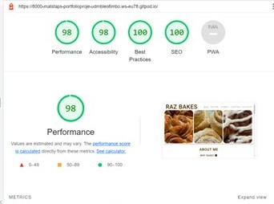

# Project 1 - Raz Bakes

A link to the live website is provided [here](https://matstaps.github.io/portfolio-project-1/).

Raz bakes is a website dedicated to showcase Raz' bakery products and for those who wish to learn to bake. 

It offers a gallery of example bakes, details of the bakery classes offered and a means for users to register their interest in those classes. 

This site was written using HTML and CSS. Additional text styling was provided using Google Font and Fontawesome.

## Features

<h3><li>Navigation </li></h3>

<li>The navigation bar sits within the header on the top-right of the page, alongside the Website name to the left.</li>
<li>The navigation links; 'Home', 'About me', 'My Bakes', 'Class Times' and 'Contact Me' all link to the respective sections of the same page.</li>
<li>The navigation font is consitent with the website, and the colour palette contrasts with the background colour.</li>

<h3>Hero Image</h3>

<li>The hero image displays three background images of the subject's baking.</li>
<li>The images' content sets the thematic tone of the website, and visually compliments the website's aesthetic. </li>

<h3>About Me</h3>

<li>The about me section introduces the subject's reasons for baking, baking background, and expresses their wish to teach others who are interested in baking. </li>
<li>It contains a background image of an example of a baked bread to compliment the aesthetic of this webpage.</li>

<h3>A Selection of my bakes</h3>

<li>This section presents a selection of images of the subject's baking.</li>
<li>It is intended to inform the user of the variety of bakes produced by the subject, giving the user an idea of the products they could learn to bake.</li>

<h3>Baking Classes</h3>

<li>This section informs users of the different baking services offered by the subject.</li>
<li>It provides information on the dates and what bake each classes focuses on.</li>

<h3>Contact Me</h3>

<li>This section allows users to register their interest in the classes offered using an HTML form.</li>
<li>The user is required to provide their first name, last name, email address, and specify which baking class they are interested in.</li>

<h3>Footer</h3>

<li>This section provides contact information for the subject.</li>
<li>It features an address, an email and social media links.</li>
<li>NB: the email presented does not currently exist, but acts as a placeholder for the link</li>

<h2>Testing</h2>

<li>I tested this site in different browsers: Chrome, Edge and Safari.</li>
<li>I confirmed that this website was responsive across different devices using the devtools device toolbar.</li>
<li>I confirm that the sections, navigation, hero image, About me, A Selection of my bakes, baking classes, contact and footer are readable and understandable.</li>

<h2>Bugs</h2>

<li>I can confirm that no bugs were detected upon deployment.</li>

## Validator Testing

<li>HTML</li>

Upon validation using [W3C HTML Validation Service](https://validator.w3.org/#validate_by_input), a warning advised that the hero-image was missing a header. This was resolved by adding a header and setting the CSS to display:none. Repeating the validation then confirmed there were no errors.

<li>CSS</li>

No errors were found when passing through the [Jigsaw CSS Validation Service](https://jigsaw.w3.org/css-validator/#validate_by_input).

<li>Accessibility</li>

The colour scheme chosen was passed through the [Color Tool](https://m2.material.io/resources/color/#!/?view.left=1&view.right=0&primary.color=E65100&secondary.color=FFEB3B) website to check the color palette against accessibility.
I confirmed that color and fonts are accessible and easy to read by running the wesbsite through Lighthouse in devtools.

## Deployment

<b><li> The site was deployed to Github, the steps as follows: </li></b>

<li> In the github repository, navigate to the settings tab </li>
<li> In the source section drop-down, select Master Branch</li>
<li> The page then provides a link to the completed website </li>

## Credits

### Content

Stylings of the Navigation Bar and About Me section were informed by CSS stylings used within the  [Love Running](https://code-institute-org.github.io/love-running-2.0/index.html) website.
Icons were sourced from the [Font Awesome](https://fontawesome.com/)website.
General HTML and CSS coding techniques were learned from the [Code Institute](https://codeinstitute.net/) tutorials and the [W3 Schools](https://www.w3schools.com/) website.

### Media

<li>All images were provided by the subject</li>

