# Project 1 - Raz Bakes

## Overview

A link to the live website is provided [here](https://matstaps.github.io/portfolio-project-1/).

Raz bakes is a website dedicated to showcase the bakery products of Raz Yacobi, a hobby baker. The website is intended to offer a visual representation of the various cakes and baked goods that she produces, by means of a gallery. The website provides a brief introduction of the subject's rationale and influences for baking, within the about me section. This website provides information on a selection of as yet fictional baking classes in a learn to bake section and a means by which users can register their interest for these classes using a form. The footer section provides contains a fictional address, email and social links.

This website intends to allow the subject a means to showcase their future bakes, and provide a potential should they wish to expand their baking activities in the future by giving classes or adding a social media presence. 

This site was written using HTML and CSS. Additional text styling was provided using [Google Fonts](https://fonts.google.com/about) and [Font Awesome](https://fontawesome.com/).

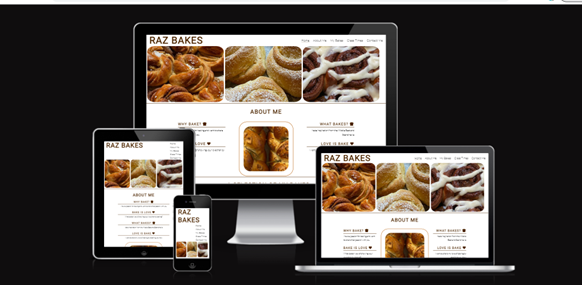

## User Experience

### User Stories
<ul>
    <li>
        First Time users
            <ol>
                To inform users of the bakers rationale and products
            </ol>
            <ol>
                To be able to easily navigate the page and find the relavant sections simply
            </ol>
            <ol>
                To easily see a selection of products            
            </ol>
            <ol>To easily find contact details of the subject
            </ol>
    </li>
    <li>
        Returning users
            <ol>
                To gain further interest in baking through the products highlighted
            </ol>
            <ol>
                To be informed of further baking classes on offer
            </ol>
    </li>
    <li>
        Frequent users
            <ol>To be regularly updated on new products and classes offered
            </ol>
    </li>        
 </ul>

## Features

### Existing Features

### Navigation

<ul>
   <li>The navigation bar sits within the header on the top-right of the page, alongside the Website name to the left.</li>
   <li>The 'Raz Bakes' Logo sits to the left. It is designed to immediately inform the user of the page's name.</li>
   <li>The navigation links; 'Home', 'About me', 'My Bakes', 'Class Times' and 'Contact Me' all link to the respective sections of the same page.</li>
   <li>The navigation font is consitent with the website, and the colour palette contrasts with the background colour.</li>
   <li>This section is responsive, the navigation bar moves below the logo and stacks vertically upon smaller screens.</li>
</ul>

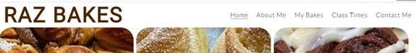

### Hero Image
<ul>
    <li>The hero image displays three background images of the subject's baking.</li>
    <li>The images are intended to immediately highlight a suggestion of the products offered for the user.</li>
    <li>The images contain baked products and highlight their natural colours and textures. The images' content sets the thematic tone of the website, and the colour palette therein visually compliments the website's aesthetic and colour palette.</li>
</ul>

### About Me

<ul>
    <li>The about me section introduces the subject's reasons for baking, baking background, and expresses their wish to teach others who are interested in baking. </li>
    <li>It contains a background image of an example of a baked bread to compliment the aesthetic of this webpage.</li>
    <li>This section is presents in three columns, with text to the left and right, and an image in the centre. It is responsive, with the columns stacking upon each other on smaller screens.</li>
</ul>

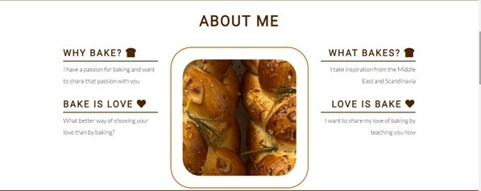

### A Selection of my bakes

<ul>
    <li>This section presents a gallery which shows a selection of images of the subject's baking.</li>
    <li>It is intended to inform the user of the variety of bakes produced by the subject, giving the user an idea of the products they could learn to bake.</li>
    <li>The section is responsive, moving from four, to two, to a single column as the viewport reduces.</li>
</ul>

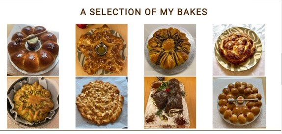

### Baking Classes

<ul>
    <li>This section informs users of the baking classes offered by the subject.</li>
    <li>It provides information on the themes that each class focusses on, and the days of the month that these classes are delivered on.</li>
    <li>The section features three classes, each display white text on a background from the colour palette, so as to be easily readable.</li>
    <li>This section is responsive, the boxes stack upon each other on smaller viewports.</li>
</ul>

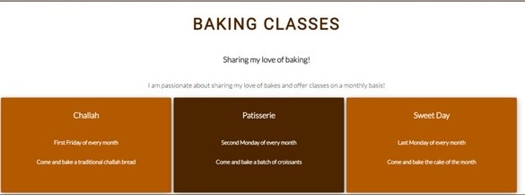

### Contact Me

<ul>
    <li>This section allows users to register their interest in the classes offered using an HTML form.</li>
    <li>The user is required to provide their first name, last name, email address, and specify which baking class they are interested in.</li>
    <li>The form contains white text and inpit boxes on a background color from the colour palette so as to be easily readable.</li>
    <li>The form has been test to submit correctly.</li>
</ul>

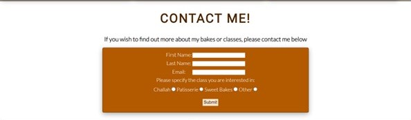

### Footer

<ul>
    <li>This section provides contact information for the subject.</li>
    <li>It features an address, an email and social media links.</li>
    <li>Each of the social media icons and email address are target linked. 9NB: the email presented does not currently exist, nor do the social media icons link to active accounts, but act as placeholders for furure links).</li>
    <li>The section places white text upon a background colour from the colour palette so as to be easily readable. The icons for social media are sourced from Font Awesome.</li>
</ul>

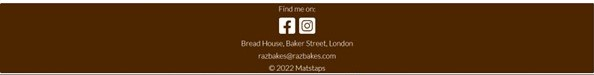

### Supporting the user experience

<li>The features intend to satisfy the aims mentions in the user stories. This single page site is designed to be easily navigable, with links to each section. Its is clearly themed with a consitent design throughout the page, and textual elements are concise.</li>

### Potential Future Features

#### Embedded video content

<li>A future section could be added to the website to embed short video elements to highlight baking techniques.</li>

#### Recipe section

<li>A future section could be added to showcase recipes and provide users with a walkthrough on baking.</li>

## Design

### Website Style

<li>A single page format was chosen to this website, the intention being that it is easy for the user to navigate to each section or to scroll through the page.</li>

### Imagery

<li>All images used are those of the subject's baking. The images intend to provide a broad selection of the subject's baking styles. The images are considered key to this website as they visually convey the subject's products. These images are largely beiges and browns in appearance.</li>

### Colour Scheme

<li>The colour scheme is intended to be easily seen by the user and provide clear text. The scheme chosen was informed the colour tones of the images. The brown/orange colour palette is intended to be sympathetic to the image colours. The background is white so as to allow the sections to stand out.</li>

### Typography

<li>The Roboto and Lato fonts were imported from Google Font. They are intended to present the website text with a simple, clean and modern feel. These two fonts compliment one another well.</li>

## Technologies used

### Languages

<ul>
    <li>HTML5</li>
    <li>CSS3</li>
</ul>

### Further Technologies

<ol>
    <li>Fonts were imported using Google Fonts.</li>
    <li>Icons were imported from Font Awesome.</li>
    <li>The code was written on Gitpod workspace, to commit and push to Github.</li>
    <li>Github was used as a repository for the code once pushed from Gitpod.</li>
</ol>

## Testing

### Browser Testing

<ul>
    <li>I tested this site in different browsers: Chrome, Edge and Safari.</li>
    <li>I confirmed that this website was responsive across different devices using the Google Chrome devtools device toolbar.</li>
    <li>I confirm that the sections, navigation, hero image, About me, A Selection of my bakes, baking classes, contact and footer are readable, understandable and responsive.</li>
    <li>I performed some manual testing on various devices, including Windows Desktop, iPhone SE, iPad</li>
</ol>

#### Nav Bar Testing

<li>I confirmed that each link; Home, About Me, My Bakes, Class Times, and Contact me, correctly link to the relevant sections.</li>

#### Contact Me Testing

<ul>
<li>I confirmed that the form element works correctly. With all input fields and radio button completed it will submit correctly. If any of inputs is blank, it provides a prompt to complete missing information before submission is allowed.</li>
<li>The Submit button hover cursor worked correctly.</li>
</ul>

#### Footer Testing

<ul>
<li>I confirmed that the Facebook and Instagram icons correctly link to their respective social media sites.</li>
<li>I confirmed the the linked email correctly links to a new mail link.</li>
</ul>

### Bugs

<li>I can confirm that no bugs were detected upon deployment.</li>

### Validator Testing

<li>HTML</li>

Upon validation using [W3C HTML Validation Service](https://validator.w3.org/#validate_by_input), a warning advised that the hero-image was missing a header. This was resolved by adding a header and setting the CSS to display:none. Repeating the validation then confirmed there were no errors.

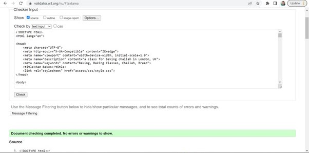

<li>CSS</li>

No errors were found when passing through the [Jigsaw CSS Validation Service](https://jigsaw.w3.org/css-validator/#validate_by_input).

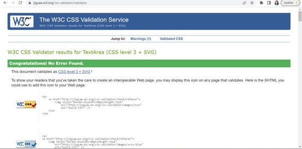

<li>Accessibility</li>

The colour scheme chosen was passed through the [Color Tool](https://m2.material.io/resources/color/#!/?view.left=1&view.right=0&primary.color=E65100&secondary.color=FFEB3B) website to check the color palette against accessibility.
I confirmed that color and fonts are accessible and easy to read by running the wesbsite through Lighthouse in devtools.

*Lighthouse desktop results:

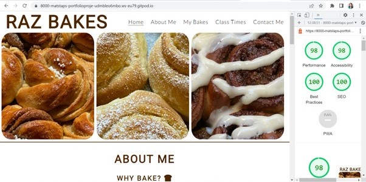

*Lighthouse mobile results: 

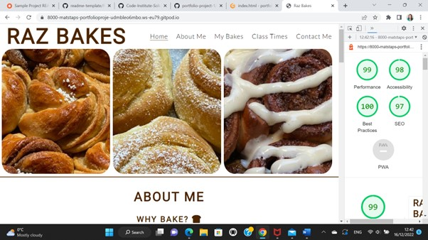

## Deployment

<b><li> The site was deployed to Github, the steps as follows: </li></b>

<ol>
    <li> In the github repository, navigate to the settings tab and choose Pages</li>
    <li> From the Source section drop-down, select Master Branch and save</li>
    <li> Once the page then refreshes, a link is provided to the live website</li>
    <li> Further changes pushed to the main branch will update the live site</li>
</ol>

## Credits

### Content

Stylings of the Navigation Bar and About Me section were informed by CSS stylings used within the  [Love Running](https://code-institute-org.github.io/love-running-2.0/index.html) website.
Icons were sourced from the [Font Awesome](https://fontawesome.com/) website.
General HTML and CSS coding techniques were learned from the [Code Institute](https://codeinstitute.net/) tutorials and the [W3 Schools](https://www.w3schools.com/) website.

### Media

All images were provided by the subject.

### Acknowledgements

<ul>
    <li>Thank you to my mentor Akshat Garg for help and direction to useful resources.</li>
    <li>Thank you to the tutors and staff at Code Institue for continued support.</li>
</ul>

